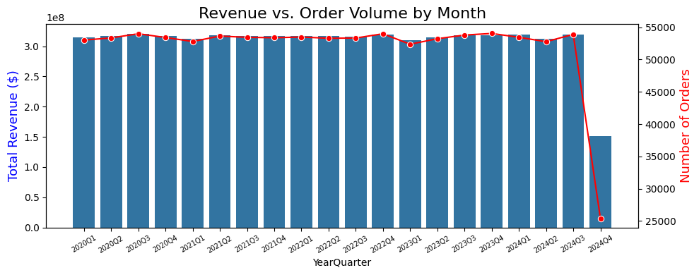
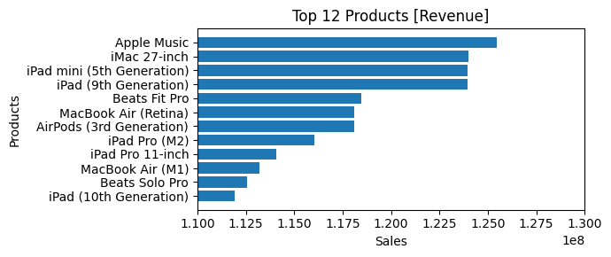

# Apple Sales & Warranty Analytics

This project analyzes Apple retail sales data using **SQL for advanced analytics** and **Python for exploratory data analysis and visualization**.

The goal is to transform raw transactional data into **actionable business insights** related to:

* Sales performance
* Store performance
* Product success
* Warranty claim patterns
* Revenue trends

---

# Database Schema

The project database consists of five main tables that store information about product categories, products, stores, sales transactions, and warranty claims.

---

## 1. Category

Stores product category information.

| Column Name   | Description                         |
| ------------- | ----------------------------------- |
| category_id   | Unique identifier for each category |
| category_name | Name of the product category        |

---

## 2. Products

Contains details about products.

| Column Name  | Description                                  |
| ------------ | -------------------------------------------- |
| product_id   | Unique identifier for each product           |
| product_name | Name of the product                          |
| category_id  | Category identifier (Foreign Key → Category) |
| launch_date  | Product launch date                          |
| price        | Product price                                |

---

## 3. Stores

Contains information about store locations.

| Column Name | Description                        |
| ----------- | ---------------------------------- |
| store_id    | Unique identifier for each store   |
| store_name  | Name of the store                  |
| city        | City where the store is located    |
| country     | Country where the store is located |

---

## 4. Sales

Stores sales transaction data.

| Column Name | Description                                 |
| ----------- | ------------------------------------------- |
| sale_id     | Unique identifier for each sale             |
| sale_date   | Date of the sale                            |
| store_id    | Store identifier (Foreign Key → Stores)     |
| product_id  | Product identifier (Foreign Key → Products) |
| quantity    | Number of units sold                        |

---

## 5. Warranty

Contains warranty claim information.

| Column Name   | Description                           |
| ------------- | ------------------------------------- |
| claim_id      | Unique identifier for each claim      |
| claim_date    | Date the claim was filed              |
| sale_id       | Sale identifier (Foreign Key → Sales) |
| repair_status | Status of the warranty repair         |

---

# How to Run

1. Clone the repository

```
git clone https://github.com/BinEmad7/apple_project_analysis.git
```

2. Open the SQL file in your preferred database system.

3. Run the Python notebook for visualization and exploratory data analysis.

---

# Business Questions & Objectives

This project aims to answer important business questions related to **retail performance and product reliability**.

### Sales & Revenue

* What are the **quarterly revenue trends** over time?
* Which **products generate the highest revenue**?
* Which **products sell the highest quantity**?

### Store Performance

* Which stores sell the **largest number of units**?
* Which **store locations drive the most revenue**?
* Which **countries have the highest number of stores**?

### Product Performance

* How many **unique products were sold in 2023**?
* What is the **average price of products in each category**?
* How do **product sales change after product launch**?

### Warranty & Product Reliability

* Which stores process the **highest number of warranty claims**?
* What **percentage of purchases result in warranty claims**?
* Which **product categories generate the most warranty claims**?
* How many claims occur **within 180 days of purchase**?

---

# Data Processing & Analysis

The dataset was processed and analyzed using **Python (Pandas)**.

Key steps included:

* Merging category, product, sales, store, and warranty tables
* Creating a **Revenue column (Price × Quantity)**
* Converting `sale_date` to datetime
* Creating a **YearQuarter column for time-series analysis**
* Aggregating revenue and order volume over time

This processed dataset was used for **exploratory analysis and visualization**.

---

# Visual Showcase

These charts are generated from the Python analysis to provide insights into sales performance.

---

## 1. Revenue vs Order Volume Trend



**Insight**

This visualization compares **total revenue and number of orders over time**.

It helps identify:

* growth trends
* seasonal sales patterns
* potential periods of increased demand

Businesses can use this information to **plan inventory and marketing campaigns**.

---

## 2. Top Products by Revenue



**Insight**

This chart highlights the **top revenue-generating products**.

Findings:

* A small number of products generate a large portion of revenue
* These products represent **core revenue drivers**
* They should receive priority in **inventory management and promotion**

---

## 3. Price vs Revenue Relationship


**Insight**

This scatter plot explores the relationship between **product price and total revenue**.

Key observations:

* Higher-priced products generate large revenue but often lower unit volume
* Mid-range products may provide the best balance between **price and demand**
* Different categories show different pricing strategies

---

# Executive Summary (Main Findings)

Based on the analysis of the dataset:

### Strategic Growth

Revenue trends show that **sales performance closely follows order volume**, indicating strong demand consistency.

### Top Performers

Certain products and stores contribute disproportionately to total revenue, highlighting **key revenue drivers** for the business.

### Product Insights

Some categories dominate both **sales volume and revenue**, suggesting strong customer demand in those segments.

### Operational Risk

Stores with higher warranty claims may require **further quality analysis or operational review** to reduce long-term service costs.

---

# SQL Analytics Highlights

Advanced SQL queries were used to perform deeper analysis including:

* Store sales performance
* Year-over-year revenue growth
* Least selling products by country
* Warranty claim risk by country
* Monthly running sales totals
* Product lifecycle sales performance
* Relationship between product price and warranty claims

Key SQL techniques used:

* Window functions (`RANK`, `LAG`)
* Common Table Expressions (CTEs)
* Aggregation queries
* Time-based analysis
* Query optimization using indexes

---

# Technologies Used

**SQL**

* Data exploration
* Analytical queries
* Window functions
* Performance optimization

**Python**

* Pandas
* NumPy
* Matplotlib
* Seaborn

**Tools**

* Jupyter Notebook
* GitHub

---

# Author

Ahmed Elsharef
